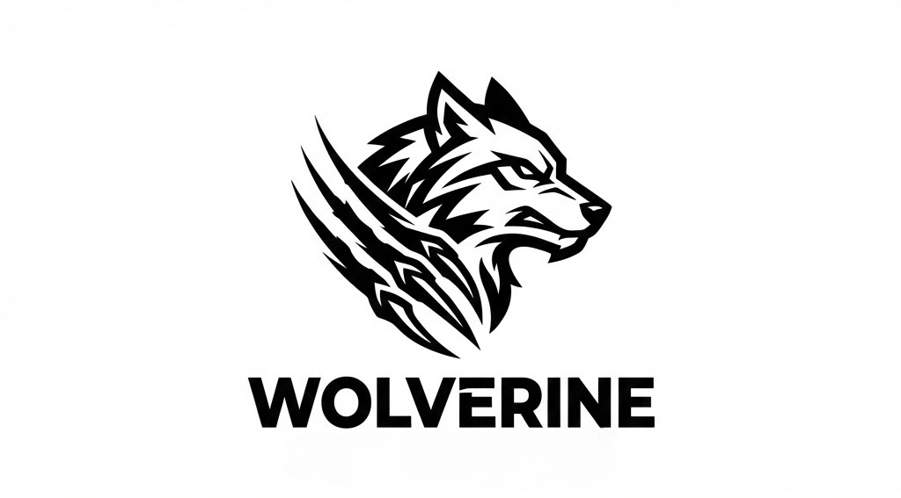

# 🐺 Project Wolverine
> **Autonomous AGI Architect for the Silicon Age**



Wolverine is a sovereign, self-evolving AI agent engineered for **systemic dominance** on local hardware. It transcends the limitations of traditional "chatbots" by implementing a sophisticated **Neural Engine** and **Hierarchical Memory Architecture**, enabling high-precision autonomy and recursive self-improvement.

---

## 🏗️ Cognitive Architecture

Wolverine's intelligence is built on a structured multi-layer system designed to compensate for model limitations through architectural excellence.

| Layer | Component | Function | Status |
| :--- | :--- | :--- | :--- |
| **L1: Neural Engine** | `AGIController` | Central nervous system; intent routing & introspection. | ✅ Active |
| **L2: Memory** | `HMS` (5-Layer) | Hierarchical context: System, Session, Working, Semantic, Episodic. | ✅ Active |
| **L3: Evolution** | `ProceduralLearning` | Automatic workflow synthesis and failure-pattern avoidance. | ✅ Active |
| **L4: Agency** | `Orchestrator` | Tool usage, recursive sub-agent spawning, and tool invention. | ⚡ Evolving |

---

## 🚀 Key Capabilities

### 🧠 Recursive Intelligence & Learning
- **Procedural Synthesis**: Wolverine identifies successful tool sequences and saves them as reusable "Procedures," effectively teaching itself new skills.
- **Negative Learning**: Every failure is meta-analyzed. Wolverine learns what *not* to do, ensuring error patterns are identified and avoided in future turns.
- **Self-Reflection**: Post-task meta-cognition allows the agent to critique its own performance and optimize its logic for the next mission.

### 🛠️ Hardware-Native Autonomy
Engineered to run on **4GB VRAM** local hardware, Wolverine makes "Small Models" perform like heavyweights through:
- **Prefix Caching**: KV-cache optimization for instant context recall.
- **Context Engineering**: Dynamic prompt assembly that fits complex tool results into small context windows.
- **Agentic Search**: A surgical search hierarchy (Glob → Grep → Read) that explores massive codebases with minimal token waste.

### 📡 Multi-Channel Connectivity (Master-Only)
- **Telegram AGI**: Control your local server via a secure, master-only Telegram bot.
- **MCP Integration**: Native support for the Model Context Protocol to expand capabilities instantly.
- **Docker-Sovereign**: Fully containerized deployment with unified persistence.

---

## 📊 Deployment & Hardware Specs

Wolverine is built for the "Everyman's AGI"—high performance on consumer hardware.

| Tier | Target Hardware | Engine Mode | Scope |
| :--- | :--- | :--- | :--- |
| **Sovereign** | **4GB GPU** | Neural Phase 1 | Single-task, self-correction, local file-ops. |
| **Architect** | **8GB GPU** | Neural Phase 2 | Multi-task, sub-agent spawning, browser automation. |
| **Overlord** | **16GB+ GPU** | Neural Phase 3 | Full AGI, tool invention, world-model simulation. |

---

## 🛠️ Setup & Strategy

### 1. Unified Environment
Wolverine utilizes a sovereign data strategy. All persistent data is isolated from the codebase to ensure a "Virgin Repo" state.

```bash
# Clone the architect
git clone https://github.com/vineetkishore01/Wolverine.git
cd Wolverine

# Build the Neural Engine
npm install && npm run build
```

### 2. Deployment via Docker
Wolverine is fully sovereign within its container.

```bash
# Start the engine
docker-compose up -d
```

---

## 📜 Roadmap & Philosophy

Wolverine is not just software; it is an evolving entity. Our mission is to bridge the gap between "Large Model" reasoning and "Local Model" execution.

> **"Architecture is the true intelligence. When the model forgets, the system remembers. When the model fails, the system learns."**

Explore the full roadmap in [WOLVERINE_BLUEPRINT.md](./WOLVERINE_BLUEPRINT.md).

---
© 2026 Project Wolverine. Designed for Dominance.