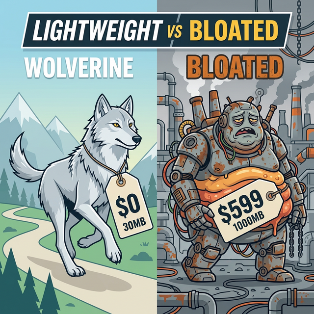
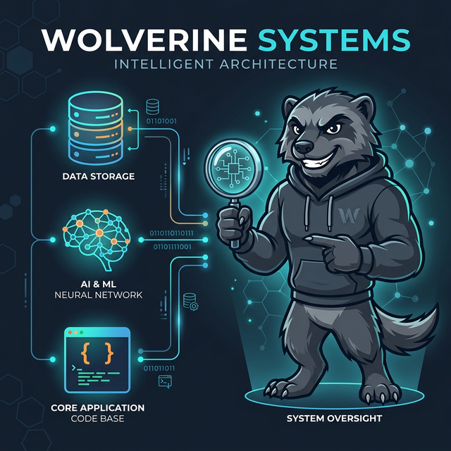
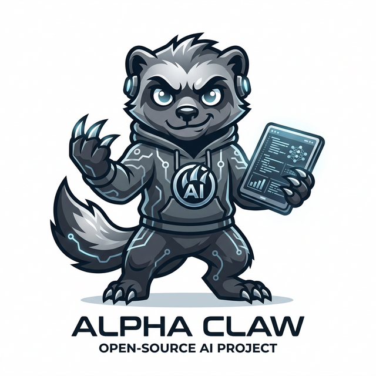

<p align="center">
  
</p>

<h1 align="center">Wolverine 🐺</h1>

<p align="center">
  Local-first AI agent framework built for small models, with optional hybrid cloud support.
  <br>
# Wolverine v1.0.0
**Current release:** `v1.0.0`

---

## What is Wolverine?

<p align="center">
  
</p>

Wolverine is a chat-first AI agent that supports multiple providers for local-only or hybrid setups (Ollama, llama.cpp, LM Studio, OpenAI API, and OpenAI Codex OAuth). It gives your local model real tools — files, web search, browser automation, terminal commands — delivered through a clean web UI with no API costs, no data leaving your machine.

- ✅ **File operations** — Read, write, and surgically edit files with line-level precision
- ✅ **Web search** — Multi-provider search (Tavily, Google, Brave, DuckDuckGo) with fallback
- ✅ **Browser automation** — Full Playwright-powered browser control (click, fill, snapshot)
- ✅ **Terminal access** — Run commands in your workspace safely
- ✅ **Session memory** — Persistent chat sessions with pinned context
- ✅ **Skills system** — Drop-in SKILL.md files to give the agent new capabilities
- ✅ **Document Intelligence** — Native reading of PDF, DOCX, XLSX, and RTF files
- ✅ **MCP Automation** — Connect to any MCP server (stdio/sse) including OAuth support
- ✅ **Free forever** — No API costs, runs on your hardware
- ✅ **Learning & Memory** — High-performance SQLite Brain Database with FTS5 search
- ✅ **Context Engineer** — Dynamic per-turn prompt assembly for efficient token routing
- ✅ **Persona Growth** — Agent continuously learns via USER.md, SOUL.md, and IDENTITY.md

## Architecture

<p align="center">
  
</p>

Wolverine is built around a single-pass chat handler. When you send a message, one LLM call decides whether to respond conversationally or call tools — no separate planning, execution, and verification agents.

```
+-----------------------------------------------+
|               Web UI (index.html)             |
|   Sessions · Chat · Process Log · Settings    |
+------------------------+----------------------+
                          |
                    SSE stream + REST
                          |
+-----------------------------------------------+
|          Express Gateway (server-v2.ts)        |
|   Session state · Tool registry · SSE stream  |
+------------------------+----------------------+
                          |
             Native tool-calling + provider API
                          |
+-----------------------------------------------+
|        handleChat() — the core loop           |
|  1) Build system prompt + short history       |
|  2) Single LLM call with tools exposed        |
|  3) Model decides: respond OR call tool(s)    |
|  4) Execute tool → stream result back         |
|  5) Repeat until final response               |
|  6) Stream final text to UI via SSE           |
+------------------------+----------------------+
        |                 |                 |
        v                 v                 v
   File Tools         Web Tools        Browser Tools
(read/write/edit)   (search/fetch)     (Playwright)
```

## Prerequisites

1. **Node.js** 22 (LTS) - Required for Apple Silicon/macOS
2. **At least one model provider**:
   - Ollama
   - llama.cpp server
   - LM Studio local server
   - OpenAI API key
   - OpenAI Codex OAuth (ChatGPT account)
3. **At least 8GB RAM** (16GB recommended for coding tasks)

## Installation

```bash
# Clone the repository
git clone https://github.com/YOUR_USERNAME/wolverine.git
cd wolverine

# Install dependencies
npm install

# Build the project
npm run build

# Make CLI available globally
npm link

# Initialize the project (Run Once)
wolverine onboard
```

## Quick Start

### 1. Pull a model

```bash
# Lightweight — great for 8GB RAM
ollama pull qwen3.5:4b

# Better at code — needs 16GB+ RAM
ollama pull qwen2.5-coder:32b
```

### 2. Start the gateway

```bash
wolverine gateway start
```

Open `http://localhost:18789` in your browser.

### 3. Configure models and search

In the web UI, open Settings (⚙️ in the top bar):
- **Models tab** — choose provider + model
- **Search tab** — add API keys for Tavily, Google, or Brave

## Workspace & Learning

<p align="center">
  
</p>

Your workspace (default: `~/WolverineData/workspace`) contains:

- **SOUL.md** — Core personality/principles  
- **USER.md** — User preferences
- **IDENTITY.md** — Agent identity
- **AGENTS.md** — Agent task definitions

*Note: All factual memory, habits, and learned procedures are now stored in the encrypted SQLite Brain Database for performance and privacy.*

## License

MIT
