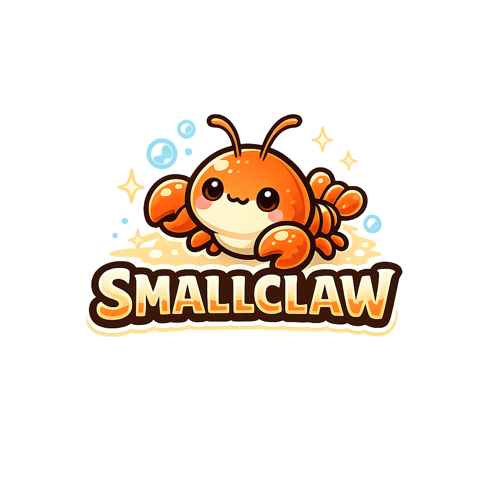
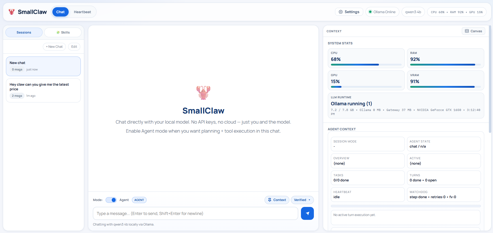

<p align="center">
  
</p>

<h1 align="center">SmallClaw 🦞</h1>

<p align="center">
  Local-first AI agent framework built for small models, with optional hybrid cloud support.
</p>

<p align="center">
  <a href="https://github.com/XposeMarket/SmallClaw/stargazers">
    
  </a>
  <a href="https://github.com/XposeMarket/SmallClaw/network/members">
    
  </a>
  <a href="https://github.com/XposeMarket/SmallClaw/issues">
    
  </a>
  <a href="https://github.com/XposeMarket/SmallClaw/blob/main/LICENSE">
    
  </a>
</p>

<p align="center">
  <a href="#installation">Install</a> ·
  <a href="#quick-start">Quick Start</a> ·
  <a href="#provider-support">Providers</a> ·
  <a href="#multi-agent-orchestration-optional-skill">Multi Agent</a> ·
  <a href="#skills">Skills</a> ·
  <a href="#troubleshooting">Troubleshooting</a>
</p>

<p align="center">
  
</p>

# SmallClaw v1.0.4

**Local AI agent framework with local + cloud provider support** — an open source alternative to cloud AI assistants that runs on your machine with free local models.

**Current release:** `v1.0.4`

---

> Image setup: put the two images in `assets/`:
> - `screenshots/SmallClaw.png`
> - `screenshots/SmallClawDashboard.png`

## What is SmallClaw?

SmallClaw is a chat-first AI agent that supports multiple providers for local-only or hybrid setups (Ollama, llama.cpp, LM Studio, OpenAI API, and OpenAI Codex OAuth). It gives your local model real tools — files, web search, browser automation, terminal commands — delivered through a clean web UI with no API costs, no data leaving your machine.

- ✅ **File operations** — Read, write, and surgically edit files with line-level precision
- ✅ **Web search** — Multi-provider search (Tavily, Google, Brave, DuckDuckGo) with fallback
- ✅ **Browser automation** — Full Playwright-powered browser control (click, fill, snapshot)
- ✅ **Terminal access** — Run commands in your workspace safely
- ✅ **Session memory** — Persistent chat sessions with pinned context
- ✅ **Skills system** — Drop-in SKILL.md files to give the agent new capabilities
- ✅ **Free forever** — No API costs, runs on your hardware

## Architecture

SmallClaw v2 is built around a single-pass chat handler. When you send a message, one LLM call decides whether to respond conversationally or call tools — no separate planning, execution, and verification agents. This dramatically reduces latency and works much better with small models that struggle to coordinate across multiple roles.

```
+-----------------------------------------------+
|               Web UI (index.html)             |
|   Sessions · Chat · Process Log · Settings    |
+------------------------+----------------------+
                         |
                   SSE stream + REST
                         |
+-----------------------------------------------+
|          Express Gateway (server-v2.ts)       |
|   Session state · Tool registry · SSE stream  |
+------------------------+----------------------+
                         |
            Native tool-calling + provider API
                         |
+-----------------------------------------------+
|        handleChat() — the core loop           |
|  1) Build system prompt + short history       |
|  2) Single LLM call with tools exposed        |
|  3) Model decides: respond OR call tool(s)    |
|  4) Execute tool → stream result back         |
|  5) Repeat until final response               |
|  6) Stream final text to UI via SSE           |
+------------------------+----------------------+
        |                 |                 |
        v                 v                 v
   File Tools         Web Tools        Browser Tools
(read/write/edit)   (search/fetch)     (Playwright)
```

### How a turn works

Every message goes through the same single path. The model sees the system prompt, a short rolling history (last 5 turns), and your message. It then either responds in plain text or emits a tool call. If it calls a tool, SmallClaw executes it and feeds the result back into the same conversation — the model keeps going until it writes a final text response. The whole thing is streamed back to the UI in real time as SSE events.

There are no separate discuss/plan/execute modes. The model decides in one shot whether a message needs tools or not.

### Session state

Each browser session stores a rolling message history (last N turns) and a workspace path. History is kept short on purpose — small models perform better with compact context than with long accumulated histories. Pinned messages let you keep important context permanently in scope without bloating every turn.

## How the Tools Work

SmallClaw uses Ollama's native tool-calling format. The model doesn't write code to execute — it returns a structured JSON tool call, SmallClaw runs it in a sandboxed environment, and the result goes back to the model as a tool response message.

### File Tools

File editing is surgical. The model is instructed to always read a file with line numbers first, then make targeted edits rather than rewriting entire files. This prevents the common small-model failure of silently dropping content during rewrites.

| Tool | What it does |
|------|-------------|
| `list_files` | List workspace directory contents |
| `read_file` | Read file with line numbers |
| `create_file` | Create a new file (fails if already exists) |
| `replace_lines` | Replace lines N–M with new content |
| `insert_after` | Insert content after line N |
| `delete_lines` | Delete lines N–M |
| `find_replace` | Find exact text string and replace it |
| `delete_file` | Delete a file |

### Web Tools

| Tool | What it does |
|------|-------------|
| `web_search` | Search across providers — returns headlines and snippets |
| `web_fetch` | Fetch and extract the full text of a URL |

Search uses a provider waterfall: Tavily → Google CSE → Brave → DuckDuckGo. You configure API keys and provider preference in Settings → Search. If no keys are set, DuckDuckGo runs without a key as a baseline fallback.

### Browser Tools

SmallClaw controls a real browser via Playwright — not just opening a URL for you to click, but navigating, filling forms, and taking snapshots itself.

| Tool | What it does |
|------|-------------|
| `browser_open` | Open a URL in a Playwright-controlled browser |
| `browser_snapshot` | Capture current page elements and layout |
| `browser_click` | Click an element by reference ID |
| `browser_fill` | Type into an input field |
| `browser_press_key` | Press Enter, Tab, Escape, etc. |
| `browser_wait` | Wait N ms then snapshot (for dynamic pages) |
| `browser_close` | Close the browser tab |

### System Tools

| Tool | What it does |
|------|-------------|
| `run_command` | Open an app or file for you to interact with (VS Code, Notepad, Chrome). SmallClaw can open it but not control it. |
| `start_task` | Launch a multi-step background task for long-running operations |

## Prerequisites

1. **Node.js** 18+ ([Download](https://nodejs.org/))
2. **At least one model provider**:
   - Ollama ([Download](https://ollama.ai/))
   - llama.cpp server
   - LM Studio local server
   - OpenAI API key
   - OpenAI Codex OAuth (ChatGPT account)
3. **At least 8GB RAM** (16GB recommended for coding tasks)

## Installation

```bash
# Clone the repository
git clone https://github.com/xposemarket/smallclaw.git
cd smallclaw

# Install dependencies
npm install

# Build the project
npm run build

# Make CLI available globally
npm link
```

## CLI Rename (Stage 1)

SmallClaw now uses the `smallclaw` command in docs and examples.

- Preferred command: `smallclaw`
- Legacy alias still works for now: `localclaw` (deprecated)

### Migration from older installs

```bash
git pull --ff-only
npm install
npm run build
npm link
```

Then use:

```bash
smallclaw gateway start
```

## Quick Start

### 1. Pull a model

```bash
# Lightweight — great for 8GB RAM
ollama pull qwen3:4b

# Better at code — needs 16GB+ RAM
ollama pull qwen2.5-coder:32b
```

### 2. Start the gateway

```bash
smallclaw gateway start
```

Open `http://localhost:18789` in your browser. That's it.

Legacy alias note: `localclaw gateway start` still works during the transition.

### 3. Configure models and search

In the web UI, open Settings (⚙️ in the top bar):

- **Models tab** — choose provider + model (Ollama, llama.cpp, LM Studio, OpenAI API, or OpenAI Codex OAuth)
- **Search tab** — add API keys for Tavily, Google, or Brave if you want better web search results

## Configuration

Config is stored in `.smallclaw/config.json` in the project folder (or `~/.smallclaw/config.json` as a fallback):

```json
{
  "models": {
    "primary": "qwen3:4b",
    "roles": {
      "manager": "qwen3:4b",
      "executor": "qwen3:4b",
      "verifier": "qwen3:4b"
    }
  },
  "ollama": {
    "endpoint": "http://localhost:11434"
  },
  "search": {
    "preferred_provider": "tavily",
    "tavily_api_key": "",
    "google_api_key": "",
    "google_cx": "",
    "brave_api_key": "",
    "search_rigor": "verified"
  },
  "workspace": {
    "path": "path/to/your/workspace"
  }
}
```

Most settings can be changed live from the Settings panel without restarting the gateway.

### Agents Array Example

User-defined agents (no preset roles). Put this in `.smallclaw/config.json`:

```jsonc
{
  "agents": [
    {
      "id": "main",
      "name": "Rafi",
      "description": "My main daily assistant. Handles chat, tasks, and general requests.",
      "emoji": "🦞",
      "default": true,
      "workspace": "D:/SmallClaw/workspace",
      "tools": { "profile": "full" },
      "minimalPrompt": false
    },
    {
      "id": "researcher",
      "name": "Scout",
      "description": "Deep web research. Given a topic, returns a structured research brief.",
      "emoji": "🔍",
      "workspace": "D:/SmallClaw/agents/researcher/workspace",
      "model": "ollama/qwen3:4b",
      "tools": { "profile": "web", "deny": ["browser"] },
      "minimalPrompt": true,
      "maxSteps": 10
    },
    {
      "id": "writer",
      "name": "Quill",
      "description": "Content writer. Takes research briefs and produces polished drafts.",
      "emoji": "✍️",
      "workspace": "D:/SmallClaw/agents/writer/workspace",
      "tools": { "profile": "coding", "deny": ["web_search", "web_fetch", "browser"] },
      "minimalPrompt": true
    },
    {
      "id": "orchestrator",
      "name": "Director",
      "description": "Coordinates other agents. Runs on a cron schedule to manage autonomous pipelines.",
      "emoji": "🎬",
      "workspace": "D:/SmallClaw/agents/orchestrator/workspace",
      "tools": { "profile": "full" },
      "minimalPrompt": false,
      "canSpawn": true,
      "spawnAllowlist": ["researcher", "writer"],
      "cronSchedule": "0 8 * * *"
    }
  ]
}
```

## Self-Updating

SmallClaw includes a built-in updater. In most cases, users can update from any install directory with:

```bash
smallclaw update
```

Use this to check first:

```bash
smallclaw update check
```

If your install was manually copied or linked from a custom path, `smallclaw update` still works, but make sure the command resolves to the same install you are currently running.

## MCP Integrations (Settings -> Integrations)

SmallClaw supports MCP server connections from the web UI. Open **Settings -> Integrations** to add servers and credentials.

- Add one or more MCP servers (local or remote)
- Configure auth/env values per server
- Save and test directly from the panel
- Use presets for common providers as a quick start

MCP tools become available to the agent after saving valid settings.

## Webhook Channels (Settings -> Channels)

SmallClaw channel connections are managed in **Settings -> Channels** with a channel selector:

- Telegram
- Discord
- WhatsApp

Each channel has its own connection fields and setup instructions. Save settings per channel, run **Test**, then **Send Test** to verify outbound delivery and webhook configuration.

## CLI Commands

### Gateway
```bash
# Start the web UI gateway
smallclaw gateway start

# Check gateway status
smallclaw gateway status
```

### Model Management
```bash
# List available local models
smallclaw model list

# Set primary model
smallclaw model set qwen2.5-coder:32b

# Pull a new model via Ollama
smallclaw model pull llama-3.3:70b
```

### System
```bash
# Health check
smallclaw doctor

# Check for updates
smallclaw update check

# Apply updates
smallclaw update
```

## Skills

SmallClaw supports drop-in SKILL.md files that give the model extra context and capabilities for specific domains. Place skill files in `.smallclaw/skills/<skill-name>/SKILL.md`. The model loads and applies them automatically when relevant.

Skills are plain markdown — write instructions, examples, and constraints in natural language. No code required.

## Provider Support

SmallClaw supports these providers in Settings -> Models:

- `ollama` (local)
- `llama_cpp` (local OpenAI-compatible server)
- `lm_studio` (local OpenAI-compatible server)
- `openai` (API key)
- `openai_codex` (ChatGPT OAuth/Codex endpoint)

Provider selection is live through the web settings API and used by the unified provider factory.

## Multi-Agent Orchestration (Optional Skill)

SmallClaw includes an optional `multi-agent-orchestrator` skill for dual-model advisor/executor behavior:

- Primary model remains executor (tools + edits).
- Secondary model gives structured planner/rescue guidance.
- Secondary preflight can run first (`off`, `complex_only`, `always`).
- Rescue can auto-trigger on failures, loops, risky edits, or no progress.

Important behavior:

- This feature is **not default**.
- It only runs when the `multi-agent-orchestrator` skill is enabled and eligible.
- If the skill is disabled, preflight/rescue/post-check continuation logic is disabled.

Current safety/quality controls:

- Assist cooldown and per-turn/session caps
- Telemetry endpoint: `GET /api/orchestration/telemetry?sessionId=<id>`
- Post-check continuation: prevents intent-only replies from ending execution early (skill-gated)

## Model Recommendations

### 8GB RAM
- **qwen3:4b** — Fast, solid for everyday tasks, file editing, web lookups

### 16GB RAM
- **qwen2.5-coder:32b** — Noticeably better at multi-file code tasks and tool sequencing
- **deepseek-coder-v2:16b** — Strong alternative for code understanding

### 32GB+ RAM
- **llama-3.3:70b** — Best reasoning and planning, handles complex multi-step tasks well

## Optimizing for Small Models

SmallClaw is specifically designed around the constraints of 4B–32B parameter models:

- **Short history window** — Only the last 5 turns are sent by default, keeping context tight
- **Line-number-first file editing** — Forces the model to read before writing, preventing content loss
- **Native tool-calling** — Uses Ollama's structured tool format instead of free-form code generation, which is much more reliable at small scales
- **Single-pass routing** — One LLM call decides whether to use tools or respond; no coordination overhead between multiple agents
- **Surgical edits over rewrites** — `replace_lines`, `insert_after`, `delete_lines` instead of `write_file` for existing files

## Troubleshooting

### "Cannot connect to Ollama"
```bash
# Start Ollama
ollama serve

# Verify it's running
curl http://localhost:11434/api/tags
```

### "No models found" in Settings
```bash
# Pull a model first
ollama pull qwen3:4b

# Confirm it's installed
ollama list
```

### "Out of memory / model crashes"
- Drop to a smaller model (qwen3:4b instead of 32b)
- Close other memory-intensive apps
- Set `llm_workers: 1` in config if you have multiple concurrent users

### Tool calls not working / model just chatting
- Check Settings → Models and confirm a model is selected and saved
- Some models handle tool-calling better than others — qwen3 and qwen2.5-coder series are most reliable
- If the model keeps ignoring tool calls, try a larger variant

## Roadmap

- [x] Single-pass native tool-calling architecture
- [x] Session-based chat UI
- [x] File editing with line-level precision
- [x] Web search with multi-provider fallback
- [x] Playwright browser automation
- [x] Skills system (SKILL.md)
- [x] Live settings (model, search, paths) from UI
- [ ] Persistent sessions (survive gateway restarts)
- [ ] Background task daemon mode
- [ ] Memory / vector store for long-running projects
- [ ] Git operations tool
- [ ] Desktop app wrapper

## Contributing

Feel Free to donate if this helped you save some API costs and help me get a Claude Max account to keep working on this faster lol - Cashapp $Fvnso - Venmo @Fvnso . 

## License

MIT

## Credits

Inspired by [OpenClaw](https://openclaw.ai) and the Anthropic team. Built for the local-first AI community.

---

**Note:** This README reflects SmallClaw `v1.0.3`.

