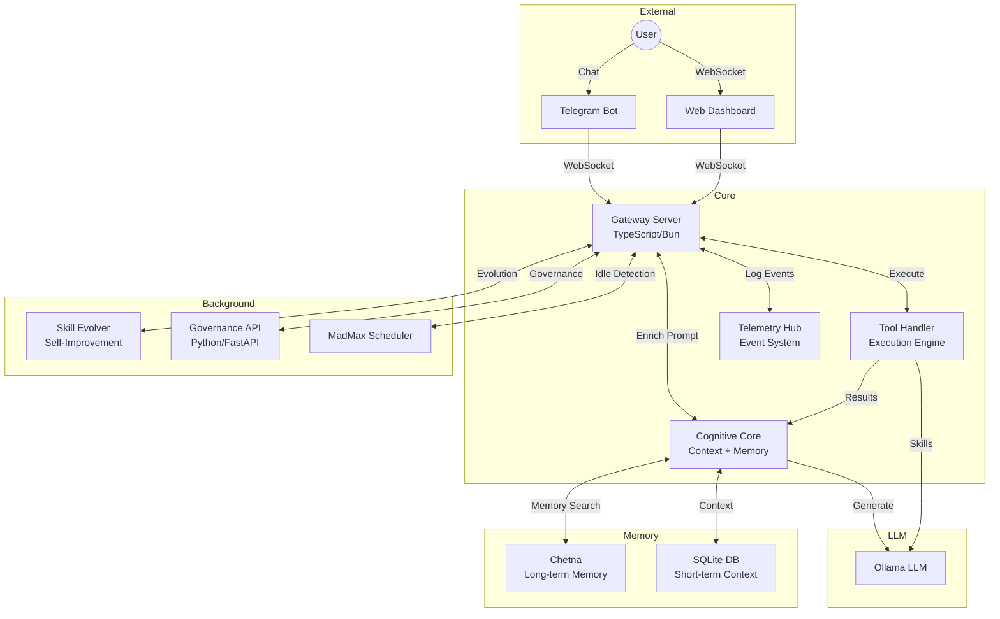

# Wolverine Architecture

## Overview

Wolverine is a hyper-autonomous AI engineering partner built with a multi-layered architecture designed for resilience, self-evolution, and long-term memory.

## System Architecture



## Core Components

### 1. Gateway Server (`src/gateway/server.ts`)
The central hub written in **TypeScript/Bun**:
- WebSocket server for real-time communication
- Routes incoming requests to Cognitive Core
- Publishes telemetry events for monitoring
- Handles chat sessions with loop detection

### 2. Cognitive Core (`src/brain/cognitive-core.ts`)
The reasoning engine:
- **Context Assembly**: Builds sparse context (5 messages + summary)
- **Memory Integration**: Queries Chetna for relevant memories
- **Prompt Engineering**: Constructs system prompts with tools
- **Memory Recording**: Extracts and stores facts in Chetna

### 3. Tool Handler (`src/core/tool-handler.ts`)
Execution engine for actions:
- Loop detection with circuit breaker
- Past lesson retrieval from Chetna
- Tool execution (system, browser, memory, telegram, subagent)

### 4. Telemetry Hub (`src/gateway/telemetry.ts`)
The observability layer:
- WebSocket broadcast to all connected clients
- Persistent logging to files
- Event categorization (chat, llm_in, llm_out, memory, etc.)

## Memory Architecture

### Short-term (SQLite)
- Stores last N messages in `messages` table
- Automatic summarization when context exceeds limit
- DAG structure for tracking message relationships

### Long-term (Chetna)
- Semantic search via vector embeddings
- Memory categories: facts, rules, habits
- Importance scoring for relevance

### Flow
```
User Message → Ingest to SQLite → Query Chetna → Build Prompt → LLM → Response
                                         ↓
                            Extract Facts → Store in Chetna
```

## Processing Pipeline

```
1. USER INPUT
       │
       ▼
2. GATEWAY (handleAgentChat)
       │
       ▼
3. COGNITIVE CORE (enrichPrompt)
   • Ingest to SQLite
   • Assemble sparse context
   • Search Chetna for memories
   • Build system prompt
       │
       ▼
4. OLLAMA (generateCompletion)
   • Model: qwen3.5:0.8b (or larger)
   • Response time: ~5-10s (slow) / ~1-2s (fast GPU)
       │
       ▼
5. RESPONSE CLEANUP
   • Strip <THOUGHT> blocks
   • Strip TOOL_CALL markers
   • Extract tool calls if present
       │
       ▼
6. TOOL EXECUTION (if needed)
   • Execute via ToolHandler
   • Return result to LLM
   • Loop up to 5 times
       │
       ▼
7. MEMORY EXTRACTION
   • Extract facts via regex
   • Store in Chetna
       │
       ▼
8. RESPONSE TO USER
```

## OBD Integration

The OBD (On-Board Diagnostics) system provides complete visibility:

```
OBD Client ──WebSocket──> Gateway ──> TelemetryHub ──> OBD Client
                                  │
                                  └──> Log Files
```

See [OBD_SYSTEM.md](./OBD_SYSTEM.md) for detailed usage.

## Configuration

Settings are managed via `settings.json`:

```json
{
  "gateway": {
    "port": 18789,
    "host": "0.0.0.0"
  },
  "llm": {
    "defaultProvider": "ollama",
    "ollama": {
      "url": "http://192.168.0.62:11434",
      "model": "qwen3.5:0.8b",
      "contextWindow": 10000,
      "temperature": 0.7
    }
  },
  "brain": {
    "memoryProvider": "chetna",
    "chetnaUrl": "http://127.0.0.1:1987"
  }
}
```

## Resilience Features

### Chetna Independence
If Chetna is offline:
1. Silent timeout in `ChetnaClient`
2. Wolverine falls back to SQLite-only context
3. Memory features disabled but chat still works

### Tool Loop Detection
- Hashes tool calls (name + params)
- Detects repetition patterns
- Force-injects strategy pivot warning

### Context Compaction
- Triggers at ~1500 tokens
- LLM summarization with identifier preservation
- DAG maintains message relationships

## Dependencies

| Component | Technology | Purpose |
|-----------|------------|---------|
| Gateway | Bun/TypeScript | WebSocket server, routing |
| LLM | Ollama | Language model |
| Memory | Chetna (Rust) | Vector search, embeddings |
| Context | SQLite | Short-term conversation |
| Evolution | Python | Skill synthesis |
| Governance | FastAPI | Approval workflows |
