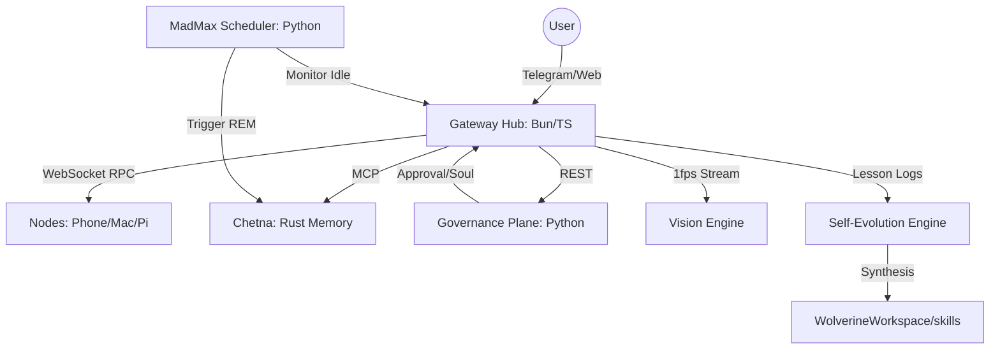

# Wolverine Architecture: The God-Tier Agent

Wolverine is a multi-language, distributed agentic framework designed for hyper-speed and autonomous self-evolution.

## System Map

## The Four Vital Organs

### 1. The Nervous System (Gateway)
Written in **TypeScript (Bun)** for sub-millisecond I/O. It handles the WebSocket Control Plane, publishes real-time Telemetry, and runs the Recursive Agentic Loop.

### 2. The Soul (Memory)
A standalone **Rust** sidecar called **Chetna**. It handles semantic embeddings, vector search, and biologically-inspired memory decay. It connects to the Gateway via the Model Context Protocol (MCP).

### 3. The Mind (Learning)
A **Python** subsystem consisting of **MadMax** (Idle detection) and the **Skill Evolver**. It analyzes log files to write new TypeScript/Python tools for itself.

### 4. The Hands (Tools)
A unified registry where **Pinchtab** (Browser Mastery) and **System** (Shell Access) live. Every tool is a plugin with a `manifest.json`.

## The Perpetual Learning Loop (The Partner Leap)
Wolverine doesn't just execute; it metabolizes experience via:
1. **Hindsight Distiller**: Intercepts user corrections and distills them into permanent 'Program Rules' in Chetna.
2. **Skill Evolver**: During system idle, analyzes failure logs to write new manifests and scripts in the workspace.
3. **Double-Link Continuity**: Every skill is stored both as code (Body) and as a semantic fact (Soul).
4. **Tool Hindsight**: Before tool execution, Wolverine queries Chetna for past failures or lessons learned with that specific tool to avoid regression.

## Cognitive Core: The Identity Handshake
Before every response, the Cognitive Core performs a **Dual-Search Handshake**:
- **Search A (Semantic)**: Finds facts related to the user's specific query.
- **Search B (Identity)**: Specifically searches for *"identity myself personality traits"* to ensure personality continuity.
- **Synthesis**: Injects both into the system prompt along with recent short-term history from the SQLite DAG.
