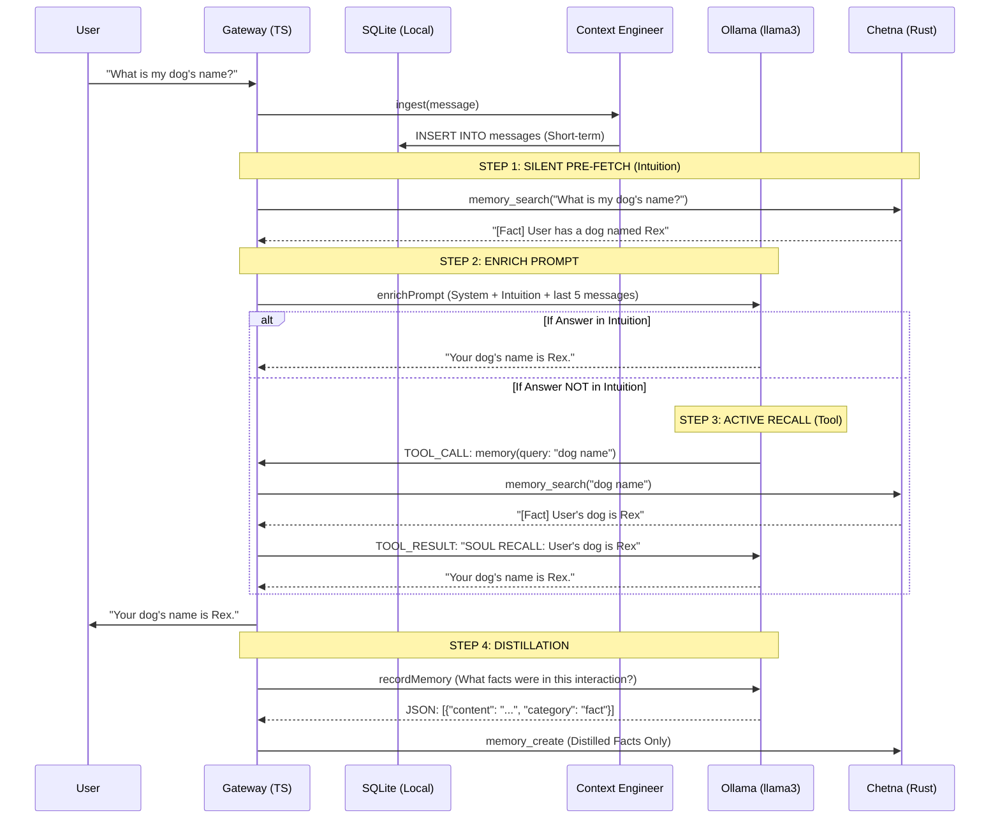

# Wolverine Information Flow & Memory Architecture

This document describes how data flows through the Wolverine system, specifically detailing the interaction between the TypeScript Gateway, the local SQLite storage, the LLM (Ollama), and the Rust-based Chetna memory engine.

---

## 1. High-Level Flow Diagram (Hybrid Dual-Handshake)

---

## 2. The Multi-Layer Memory System

Wolverine uses three distinct layers of memory to balance speed, context limits, and long-term intelligence.

### Layer 1: The "Nervous System" (Local SQLite)
*   **Module**: `src/db/database.ts` / `src/brain/context-engineer.ts`
*   **Purpose**: Immediate conversational continuity (Short-term).
*   **Flow**: Every message (User or Assistant) is instantly written to the `messages` table in SQLite.
*   **Behavior**: Wolverine only "sees" the last 5 messages from this table in every prompt to keep latency low and avoid token overflow.

### Layer 2: The "Summary Layer" (DAG Compaction)
*   **Module**: `ContextEngineer.maybeCompact()`
*   **Purpose**: Mid-term context retention.
*   **Flow**: When the SQLite `messages` table exceeds a token limit (default 1500), the oldest messages are sent to the LLM to be summarized into a "fact-dense paragraph."
*   **Behavior**: This summary is stored in the `summaries` table and prepended to the prompt as `CONTEXT SUMMARY`.

### Layer 3: The "Soul" (Chetna - Rust Engine)
*   **Module**: `src/brain/chetna-client.ts` / `Chetna (External Project)`
*   **Purpose**: Long-term semantic memory and identity.
*   **Flow (Hybrid Dual-Handshake)**:
    1.  **Passive Pre-fetch (Intuition):** Before every LLM call, the Gateway silently queries Chetna for relevant facts and injects them into the system prompt.
    2.  **Active Recall (Tool):** If the answer isn't in the pre-fetched context, the LLM uses the `memory` tool for a targeted search.
    3.  **Distilled Saving:** After a response, the LLM extracts high-signal facts (e.g., "User lives in NYC") and only saves those to Chetna, rather than saving the raw chat.

---

## 3. Step-by-Step Scenario Analysis

### Scenario A: "Hello, my name is Vineet" (Memory Ingestion)
1.  **Ingestion**: `ContextEngineer` saves the raw string to SQLite.
2.  **Enrichment**: `CognitiveCore` builds a prompt. History is empty.
3.  **Generation**: Ollama generates a greeting.
4.  **Distillation**: `CognitiveCore.recordMemory` triggers a background LLM call. It extracts: `[{"content": "User's name is Vineet", "category": "fact"}]`.
5.  **Persistence**: ONLY the extracted high-signal fact is sent to Chetna.

### Scenario B: "Do you remember my name?" (Memory Retrieval)
1.  **Passive Pre-fetch**: Gateway searches Chetna for "Do you remember my name?".
2.  **Intuition Injection**: Chetna returns the fact "User's name is Vineet". It's injected into the prompt.
3.  **Instant Answer**: The LLM sees the name in the `[PASSIVE INTUITION]` block and answers immediately without needing a tool call.

---

## 4. Guardrails (Robustness & Edge Cases)
*   **Infinite Loop Protection:** The system prompt forbids the LLM from using the `memory` tool more than once per turn.
*   **False Positive Protection:** Pre-fetched context is labeled as "Intuition" that "may or may not be relevant," preventing the LLM from being derailed by weak vector matches.
*   **Vector Blindness Fix:** If the pre-fetch fails (common with questions), the LLM is trained to use the `memory` tool with *declarative keywords* (e.g., searching for "name" instead of "what is my name").

---

## 5. Key Modules & Files
---

## 6. The Edge Case Handbook: Robustness & Logic

This section details how Wolverine handles complex, real-world scenarios to prevent failure loops, hallucinations, and data corruption.

### Use Case 1: Conflicting Memories (The Evolution Problem)
*   **Scenario:** In 2024, user says "I love Python." In 2025, user says "Actually, I hate Python now, I only use Rust."
*   **Wolverine's Approach:**
    1.  **Passive Pre-fetch:** Both facts are pulled from Chetna.
    2.  **LLM Reasoning:** The LLM sees the contradiction in the `[PASSIVE INTUITION]` block.
    3.  **Action:** Instead of picking one randomly, the LLM is instructed to ask: *"I have two different notes about your preference—earlier you liked Python, but recently you mentioned Rust. Which one should I prioritize today?"*
    4.  **Correction:** Once the user answers, the new distilled memory is saved with high importance, effectively overriding the relevance of the old one in future searches.

### Use Case 2: Ambiguous or "Vector Blind" Queries
*   **Scenario:** User asks "What did we talk about that time in the park?"
*   **Wolverine's Approach:**
    1.  **Pre-fetch Failure:** A vector search for "talk about that time in the park" might return zero results because "park" wasn't the *topic* of the conversation.
    2.  **Active Recall Search:** The LLM realizes the intuition is empty and uses the `memory` tool.
    3.  **Recursive Search:** It might try a broader query like `memory("park experience")` or `memory("meeting outdoors")`.
    4.  **Fallback to Summary:** If Chetna fails, the LLM checks its `CONTEXT SUMMARY` from Layer 2 to see if the "park" mention was captured during message compaction.

### Use Case 3: Tool Execution Failure (Hindsight Loop)
*   **Scenario:** The LLM tries to use the `browser` tool to visit a site, but the site is down.
*   **Wolverine's Approach:**
    1.  **Hindsight Lookup:** Before retrying, `ToolHandler` queries Chetna: *"Have I failed to visit this site before?"*
    2.  **Lesson Injection:** If a past failure exists, it is injected into the prompt: `[PAST LESSON: Site X was down yesterday, don't try again.]`.
    3.  **Alternative Strategy:** The LLM pivots to a different tool (e.g., searching for a cached version of the page) instead of repeating the mistake.

### Use Case 4: Chetna Engine Offline (Retard Mode)
*   **Scenario:** The Rust service on port `1987` crashes or is unreachable.
*   **Wolverine's Approach:**
    1.  **Graceful Degradation:** All Chetna calls (`memory_search`, `memory_create`) are wrapped in timeouts and try/catches.
    2.  **Survival:** Wolverine continues using **Layer 1 (Local SQLite)**. It still remembers the last 5 messages and its high-level summary.
    3.  **State Notification:** The LLM is aware its "Deep Memory" is unavailable and tells the user: *"I'm having trouble accessing my long-term memory, but I can still help you with what we're discussing right now."*

### Use Case 5: Sensitive Data & Privacy (Memory Redaction)
*   **Scenario:** User shares a password or API key during a debugging session.
*   **Wolverine's Approach:**
    1.  **Distillation Filter:** During `recordMemory`, the LLM is instructed: *"Do NOT save secrets, passwords, or credentials into long-term memory."*
    2.  **Redaction:** The LLM identifies the sensitive string and either skips saving it or replaces it with `[REDACTED_API_KEY]`.
    3.  **Ephemeral-only:** The secret remains in Layer 1 (SQLite) for the current session to ensure the tool works, but it never enters the permanent "Soul" layer (Chetna).

### Use Case 6: Infinite "Am I Right?" Loops
*   **Scenario:** The LLM keeps using the `memory` tool to verify its own answers in a circle.
*   **Wolverine's Approach:**
    1.  **Token of Finality:** The Gateway tracks `loopCount`.
    2.  **One-Search Rule:** The system prompt enforces: *"You get ONE search. If you don't find it, stop searching and inform the user."*
    3.  **State Tracking:** If the tool output is identical to a previous result in the same turn, the `ToolHandler` throws an error to break the loop.

### Use Case 7: Long-Session Identifier Preservation
*   **Scenario:** A user is debugging a specific file path `/src/components/auth/Login.tsx` over 100 messages.
*   **Wolverine's Approach:**
    1.  **Identifier Scanning:** Before summarization, the `ContextEngineer` scans for technical strings (UUIDs, Paths, IPs).
    2.  **Strict Pinning:** It identifies `/src/components/auth/Login.tsx` as a critical path.
    3.  **Summary Enrichment:** The summary is created as: `[STRICT_IDENTIFIERS: /src/components/auth/Login.tsx] User is refactoring the login logic...`
    4.  **Result:** Wolverine never "forgets" the exact file it is editing, even after the raw message is deleted from the context window.

### Use Case 8: Complex Multi-Step Delegation (Async Subagents)
*   **Scenario:** User says "Build a full-stack dashboard."
*   **Wolverine's Approach:**
    1.  **Decomposition:** The parent agent uses `<THOUGHT>` to plan: "I will spawn one subagent for the frontend and one for the backend."
    2.  **Async Spawning:** It calls `subagent(task: "Build frontend UI", mode: "run")`.
    3.  **Non-Blocking:** The tool returns `childSessionKey: dashboard-fe-123`. The parent doesn't wait; it proceeds to spawn the backend subagent.
    4.  **Event-Driven Completion:** When the subagents finish, their summaries are injected into the parent's chat: `[Subagent Result: dashboard-fe-123: Frontend code written to /web-ui]`.
    5.  **Final Integration:** The parent reviews the children's work and informs the user.
